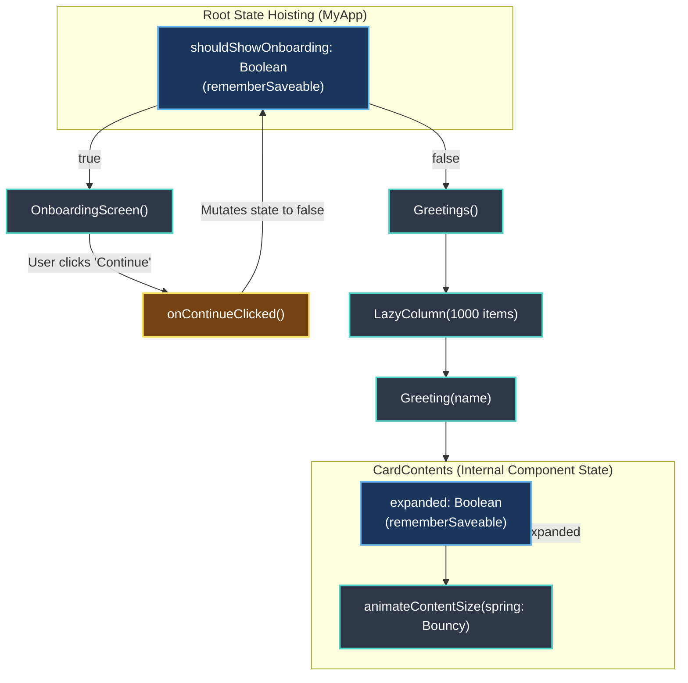

# Jetpack Compose Basics Codelab

[](https://developer.android.com)
[](https://kotlinlang.org)
[](https://developer.android.com/jetpack/compose)
[](https://m3.material.io)
[](LICENSE)

> An interactive Jetpack Compose starter project demonstrating state hoisting, survival across configuration changes with `rememberSaveable`, spring-physics list animations, and Material 3 design systems.

---

## 📖 Overview

The **Compose-BasicCodeLab** project demonstrates fundamental paradigm shifts introduced by Jetpack Compose. Unlike imperative Android UI toolkits that mutate existing view trees, this application showcases **declarative UI rendering**, where the interface is a direct mathematical function of state ($UI = f(State)$).

### 🎯 Key Learning Objectives
- **Unidirectional Data Flow (UDF)**: Understanding how state flows down and events flow up through composable hierarchies.
- **State Hoisting**: Promoting state to common ancestors (`MyApp`) to decouple business logic and make composables stateless, reusable, and easily testable.
- **Configuration Survival**: Leveraging `rememberSaveable` to retain UI state (such as onboarding status and card expansion) across device rotations and process recreations.
- **Physics-Based UI Animations**: Utilizing Jetpack Compose's `animateContentSize` with customized `spring` specs (`DampingRatioMediumBouncy` and `StiffnessLow`).
- **High-Performance Lists**: Rendering virtualized collections containing 1,000+ dynamic items via `LazyColumn`.

---

## 🏗️ Architecture & State Flow



---

## ✨ Core Concepts & Patterns Demonstrated

### 1. State Hoisting & Unidirectional Data Flow
State is elevated to `MyApp`, allowing seamless transitions between the Onboarding screen and the Greeting feed:
```kotlin
@Composable
fun MyApp(modifier: Modifier = Modifier) {
    var shouldShowOnboarding by rememberSaveable { mutableStateOf(true) }

    Surface(modifier, color = MaterialTheme.colorScheme.background) {
        if (shouldShowOnboarding) {
            OnboardingScreen(onContinueClicked = { shouldShowOnboarding = false })
        } else {
            Greetings()
        }
    }
}
```

### 2. Spring-Physics Animated Card Expansion
Cards dynamically expand to show detailed text with a fluid spring oscillation curve:
```kotlin
@Composable
fun CardContents(name: String) {
    var expanded by rememberSaveable { mutableStateOf(false) }

    Row(
        modifier = Modifier
            .padding(12.dp)
            .animateContentSize(
                animationSpec = spring(
                    dampingRatio = Spring.DampingRatioMediumBouncy,
                    stiffness = Spring.StiffnessLow
                )
            )
    ) {
        Column(
            modifier = Modifier
                .weight(1f)
                .padding(12.dp)
        ) {
            Text(text = "Hello ")
            Text(
                text = name,
                style = MaterialTheme.typography.headlineMedium.copy(fontWeight = FontWeight.Bold)
            )
            if (expanded) {
                Text(
                    text = ("Compose ipsum colors sit smoothly, padding themes elegantly... ").repeat(4)
                )
            }
        }
        IconButton(onClick = { expanded = !expanded }) {
            Icon(
                imageVector = if (expanded) Icons.Filled.ExpandLess else Icons.Filled.ExpandMore,
                contentDescription = if (expanded) stringResource(R.string.show_less) else stringResource(R.string.show_more)
            )
        }
    }
}
```

### 3. Virtualized Lazy Lists (`LazyColumn`)
Replaces legacy `RecyclerView` adapters and view holders with a single declarative construct that efficiently emits visible items on demand.

### 4. Material 3 Theming & Multipreview
Pre-configured with light and dark mode `@Preview` definitions, verifying UI contrast and typography across form factors.

---

## 📱 Key Components & Project Structure

```
Compose-BasicCodeLab/
├── app/
│   ├── src/main/java/com/example/basiccodelab/
│   │   ├── MainActivity.kt                # Host Activity, Onboarding & Greeting Composables
│   │   └── ui/theme/
│   │       ├── Color.kt                   # Material 3 Color tokens (Purple / Blue variants)
│   │       ├── Theme.kt                   # BasicCodeLabTheme wrapper & dynamic color logic
│   │       └── Type.kt                    # Custom Typography hierarchy
│   ├── src/main/res/
│   │   ├── drawable/                      # Vector drawables & launcher icons
│   │   └── values/                        # Localized string keys (show_more, show_less)
│   └── build.gradle.kts                   # Kotlin DSL Gradle build script & Compose BOM
└── gradle/
    └── libs.versions.toml                 # Version Catalog for dependencies & plugins
```

---

## 🛠️ Technology Stack Matrix

| Component | Library / Framework | Version / Notes |
|---|---|---|
| **Platform** | Android | API 24+ (Target SDK 35, Compile SDK 35) |
| **Language** | Kotlin | 2.0+ with Kotlin Compose Compiler Plugin |
| **UI Toolkit** | Jetpack Compose | Compose BOM (`androidx.compose:compose-bom`) |
| **Design System** | Material Design 3 | `androidx.compose.material3:material3` |
| **Animation Engine** | Compose Animation Core | Physics-based spring animations |
| **Architecture** | Unidirectional Data Flow | State hoisting & `rememberSaveable` |
| **Tooling** | Android Studio Preview | Multipreview (Light & Dark theme variants) |

---

## 🚀 Getting Started

### Prerequisites
- **Android Studio Ladybug (2024.2.1+)** or newer.
- **JDK 17 or JDK 21**.
- **Android SDK 35**.

### Build & Run
1. **Clone the repository**:
   ```bash
   git clone https://github.com/shayann07/Compose-BasicCodeLab.git
   cd Compose-BasicCodeLab
   ```
2. **Open in Android Studio**: Open the folder and allow Gradle to complete dependency resolution.
3. **Execute Build**:
   ```bash
   ./gradlew assembleDebug
   ```
4. **Deploy**: Run on an emulator or physical device running Android 7.0 (Nougat) or higher.

---

## 📄 License

This project is licensed under the [MIT License](LICENSE) — Copyright (c) 2026 [shayann07](https://github.com/shayann07).
